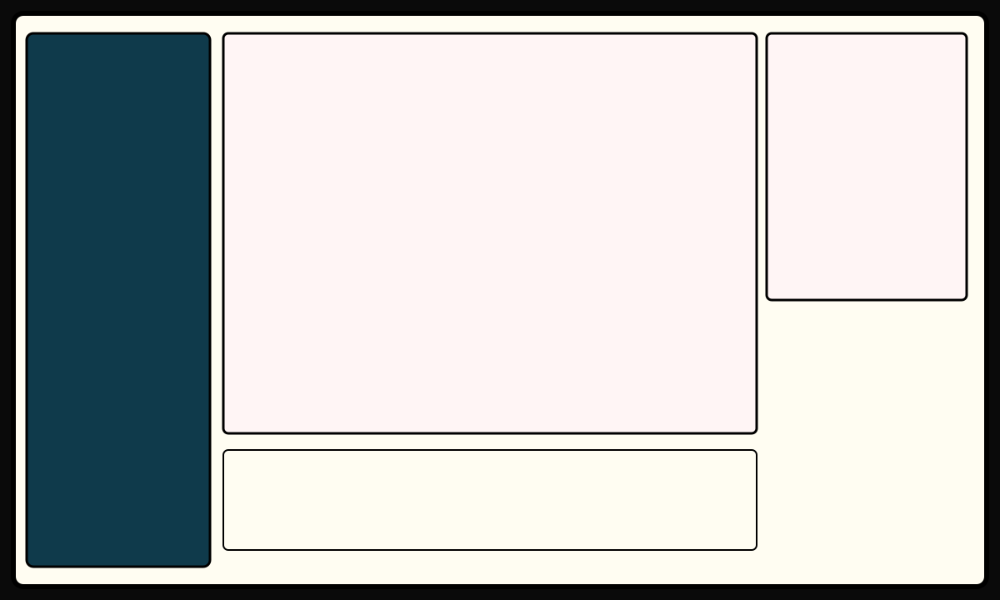

# LibraryManager — Wireframe

Objetivo: mejorar la exploración de la biblioteca, filtros y controls de miniaturas.

## Wireframe
- Left: filtros (search, tags, sort)
- Center: grid de miniaturas con controles de tamaño y vista (grid/list)
- Right: vista previa / metadatos del cómic seleccionado

### Notas
- Control de tamaño de miniaturas (slider) con preview inmediato.
- Soporte para selección múltiple y acciones (delete, marcar leído).
- Accesibilidad: keyboard nav, focus visible, labels ARIA.
