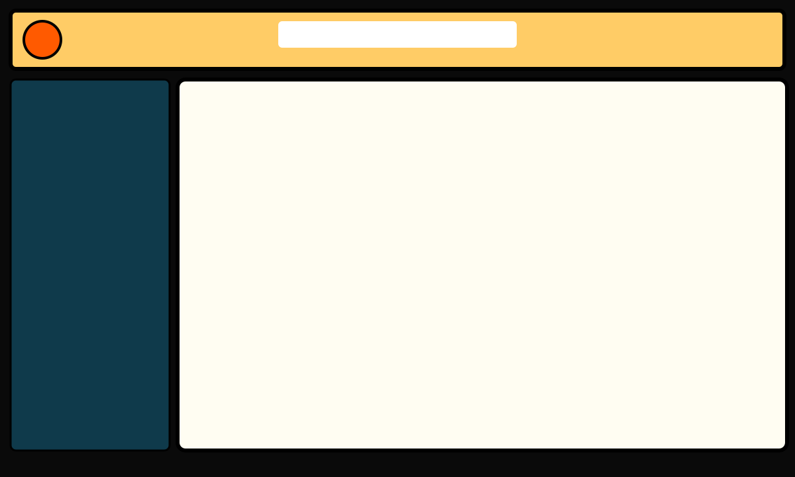
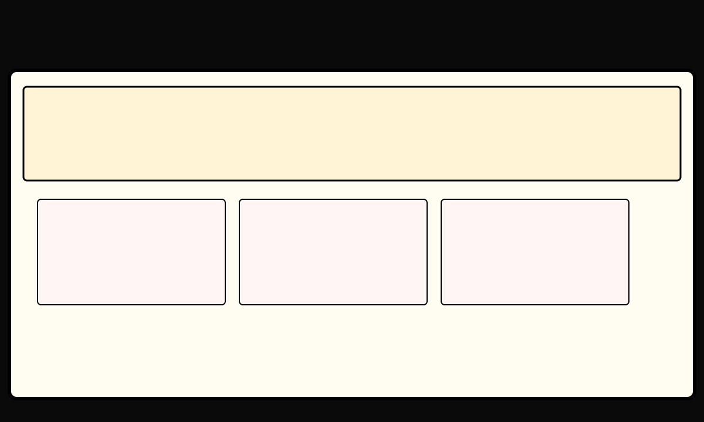

# Sprint 1 — Wireframes

Incluye wireframes y notas para: MainWindow, HomeView, LibraryManager.

## MainWindow (Wireframe)
- Header: logo a la izquierda, búsqueda central, acciones a la derecha.
- Sidebar: acceso a Library, Favorites, Settings (insignias)
- Content area: muestra HomeView o Library según selección

## HomeView (Wireframe)
- Hero panel con último cómic leído
- Cards para secciones: Continuar, Favoritos, Colecciones

