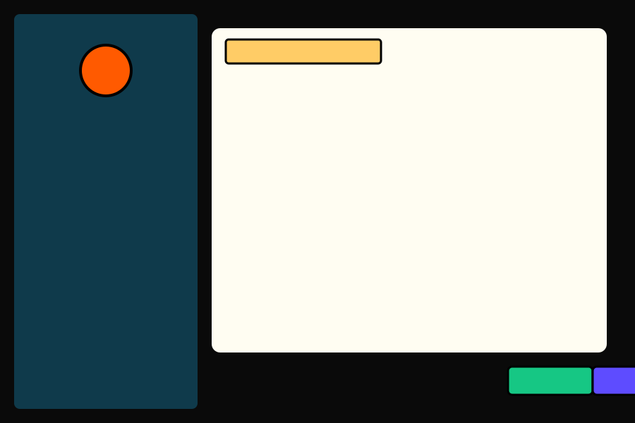
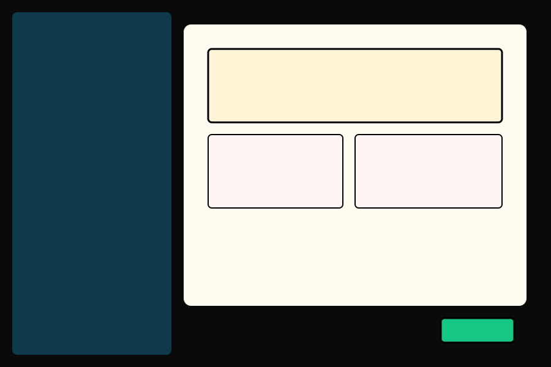

# Wireframes — Interfaz de Configuración "Percy's Library"

Este documento incluye wireframes y notas de interacción para la vista de configuración con estética cómic.

## Wireframe: General (baja fidelidad)

- Columna izquierda: navegación con insignias (General activo)
- Panel derecho: viñeta principal con título "AJUSTES DEL SISTEMA" y controles de ejemplo
- Footer: botones de acción (¡APLICAR!, ¡GUARDAR!, ¡CANCELAR!)

### Notas de interacción
- Seleccionar una insignia desplaza el panel principal con animación breve.
- Slider con thumb-puño actualiza el Monitor de Pruebas en tiempo real.

## Wireframe: Apariencia

- Similar layout, centro con previews de temas, selects para fuentes y paletas.

### Notas
- Preview en tiempo real con controles para intensidad del semitono y textura de papel.
- Botones de reset y aplicar dentro de cada sub-viñeta.
